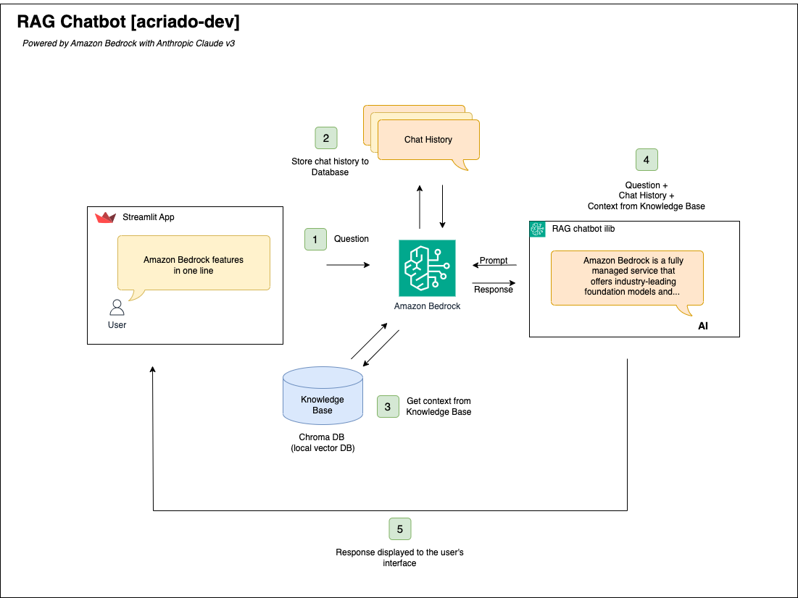

# RAG Chatbot with Streamlit and Amazon Bedrock


<!-- TOC -->
* [RAG Chatbot with Streamlit and Amazon Bedrock](#rag-chatbot-with-streamlit-and-amazon-bedrock)
  * [Architecture](#architecture)
    * [Workflow](#workflow)
  * [Getting Started](#getting-started)
    * [Prerequisites](#prerequisites)
    * [Project structure](#project-structure)
    * [Environment](#environment)
    * [Running the project](#running-the-project)
  * [Testing](#testing)
    * [Local testing](#local-testing)
    * [Automated Testing with GitHub Actions](#automated-testing-with-github-actions)
  * [How-to](#how-to)
    * [Populate ChromaDB](#populate-chromadb)
    * [Amazon Bedrock Setup](#amazon-bedrock-setup)
  * [Useful Commands](#useful-commands-)
    * [Python](#python)
    * [Streamlit](#streamlit)
    * [Docker](#docker)
  * [Contributing](#contributing)
  * [License](#license)
<!-- TOC -->

## Overview
This project implements a Retrieval-Augmented Generation (RAG) chatbot using Streamlit as a frontend.
The bot leverages Amazon Bedrock, specifically the Anthropic Claude v3 model for natural language processing.
It also uses a local instance of ChromaDB for storing and querying embeddings related to Amazon Bedrock FAQs.

In this project, Amazon Bedrock's built-in tool will be used to decide when to use retrieved-augmented generation pattern.
In order to demonstrate that, an example tool of Math cosinus calculation has been added in addition to amazon bedrock faqs collection.
Then, in the response chat form bot, if RAG has been used, will be shown, as well as the specific tool used:

### Demo/Showcase
[TODO: Pending to add some gifs of the application running]

## Architecture


### Workflow:
1. The user enters a new question in the Streamlit Chat App.
2. The Chat history is retrieved from memory object and added prior the new message entered.
3. The question is converted to a vector using Amazon Titan Embeddings, then matched to the closests vector in the database to retireve context.
4. The combination of new Question received, Chat history, and Context from the Knowledge base are sent to the model.
5. The model's response is displayed to the user in the StreamLit App.

## Getting Started
### Prerequisites
- AWS account with access to Amazon Bedrock.
[TODO: Link to internal section on how to configure amazon bedrock]
- Docker installed locally.
- Environment variables for AWS credentials and ChromaDB paths.

### Project structure
```
.
├── Dockerfile              # Dockerfile for building the project container
├── docker-compose.yml      # Docker Compose setup
├── rag_chatbot_app.py      # Streamlit app entry point
├── rag_chatbot_lib.py      # Core RAG chatbot logic
├── populate_collection.py  # Initializes ChromaDB collections
└── data                    # Contains data files and configuration
    └── chroma              # Directory to store ChromaDB data

```

### Environment
Create a .env file or set the following environment variables before running the project:

- AWS_ACCESS_KEY_ID - Your AWS access key.
- AWS_SECRET_ACCESS_KEY - Your AWS secret key.
- AWS_DEFAULT_REGION - Your AWS region (default: eu-central-1).
- CHROMA_DB_PATH - Path to the ChromaDB storage. (default: data/chroma)
- COLLECTION_PATH - Path to the embeddings collections. (default: data)

### Running the project
You can use Docker Compose to run the project locally:

1. Clone the repository:
```
git clone https://github.com/acriado-dev/amazon-bedrock-rag-chatbot.git
cd amazon-debrock-rag-chatbot
```

2. Ensure that `.env` file is created and with the specific environment variables set. Specially AWS Credentials of your account

(Example:)
```
AWS_ACCESS_KEY_ID=XXXXXXXXXX
AWS_SECRET_ACCESS_KEY=XXXXXXXXXXXXXXXXXXXX
AWS_DEFAULT_REGION=eu-central-1
CHROMA_DB_PATH=data/chroma
COLLECTIONS_PATH=data
```

3. Build and run Docker compose

```
docker-compose up -d
```

This will initialize the ChromaDB collections and launch the Streamlit app at http://localhost:8502.

## Testing
This project includes automated tests for the Streamlit app, using pytest for test management and 
GitHub Actions for continuous integration.

### Local testing
To run the tests locally, install the required dependencies and execute the tests with pytest:

- Install the dependencies:
```
pip install -r requirements.txt
```

- Run the tests:
```
pytest -v --junit-xml=test-results.xml
```

### Automated Testing with GitHub Actions
A GitHub Actions workflow is set up to automatically run the tests on every `push` or `pull request` to the **main** branch. 
The workflow uses streamlit-app-action to run the Streamlit app and pytest to verify the application's functionality.

## How-to

### Populate ChromaDB
For the purpose of this project, ChromaDB instance is initialized locally by populating the collections in `data` folder.
The process loads the data from JSON files, embeds it using Amazon Bedrock's Titan embedding model, and stores it in ChromaDB.

It has been established as a startup `command`in docker compose, but can be executed manually if the project is dpeloyed in local
development machine:

```
python populate_collection.py
```

### Amazon Bedrock Setup
This project assumes that yoiu have access to Amazon Bedrock and a profile to access programatically with the required permissions. 
However, foundation models of Amazon Bedrock has to be grantesd specifically for each region.
Below we will show an example of how to configure model access in Amazon Bedrock:

1. In the region where you want to integrate the chatbot, Find Amazon bedrock in the console.
2. In the side menu, select `Model Access`
3. Select `Enable specific models`
4. Select the checkboxes required to acitvate the models. In our case will be the ones corresponding to `Anthropic - Claude 3 Sonnet`
5. Click `Review and Summit'
6. It may take a few minutes to be granted, you can view the progress in the console.

>Reference: https://docs.aws.amazon.com/bedrock/latest/userguide/model-access-modify.html


## Useful Commands 
### Python

- create the ".venv" environment:
```
python3 -m venv .venv
```

- Activate virtual environment
```
source .venv/bin/activate
```

- Upgrade pip (recommended)
```
python3 -m pip install --upgrade pip
```

- Install required packages
```
pip install chromadb
```

- Deactivate virtual environment
```
deactivate
```

### Streamlit

- You can run streamlit locally with the following 2 commands:
```
python -m streamlit run streamlit_hello_world.py
streamlit run rag_chatbot_app.py --server.port 8080
```

### Docker

- Build:
```
sudo docker build -t rag-chatbot:develop.1 .
```

- Run:
```
docker run -e AWS_ACCESS_KEY_ID=XXXXXXXXXX \
           -e AWS_SECRET_ACCESS_KEY=XXXXXXXXXXXXXXXXXXXx \
           -e AWS_DEFAULT_REGION=eu-central-1 \
           rag-chatbot:develop.1
```


## Contributing
Contributions are welcome! Feel free to submit issues or pull requests to improve the project.

## License
This project is licensed under the MIT License.
